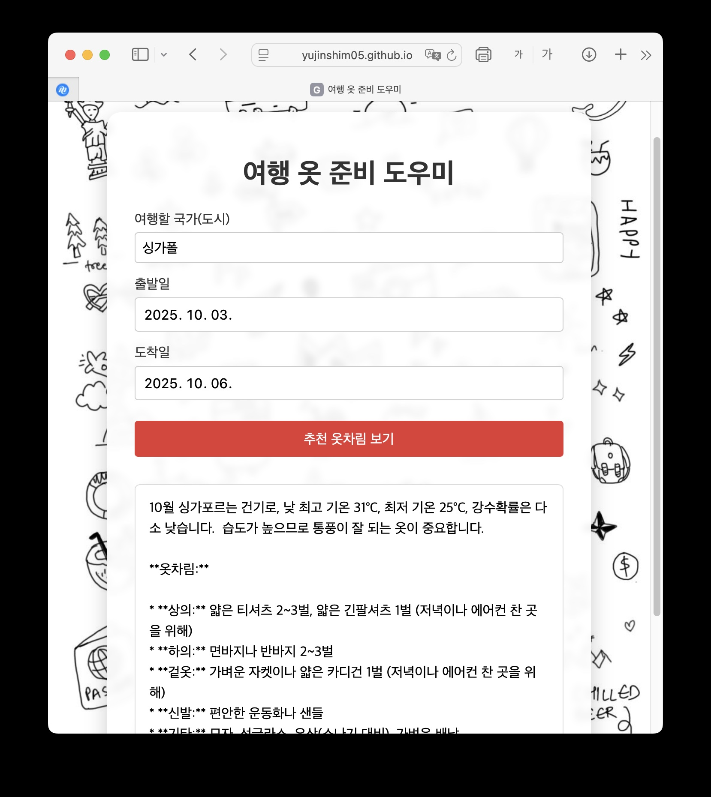

# 여행 옷 준비 도우미 (프론트엔드)


본 웹사이트는 여행을 떠나는 사용자가 여행 기간과 장소를 입력하면,  
적절한 옷차림을 추천해주는 인공지능 서비스를 제공합니다.

---

## 🔗 배포 주소

👉 [https://yujinshim05.github.io/tripfit/](https://yujinshim05.github.io/tripfit/)

---

## ✨ 사용 기술

- HTML
- CSS
- JavaScript
- GitHub Pages (프론트엔드 배포용)

---

## 🖥️ 사용 방법

1. **여행할 국가(도시)**를 입력
2. **출발일 / 도착일**을 선택
3. `추천 옷차림 보기` 버튼을 클릭하면 AI가 추천 결과를 반환

---

## 🔌 백엔드 연동

- 이 프론트는 Vercel에 배포된 백엔드 API와 연결됩니다.
- 실제 요청은 아래와 같은 형식으로 전송됩니다:

```json
POST /api/duksungAI
{
  "location": "도쿄",
  "startDate": "2025-06-20",
  "endDate": "2025-06-24"
}
